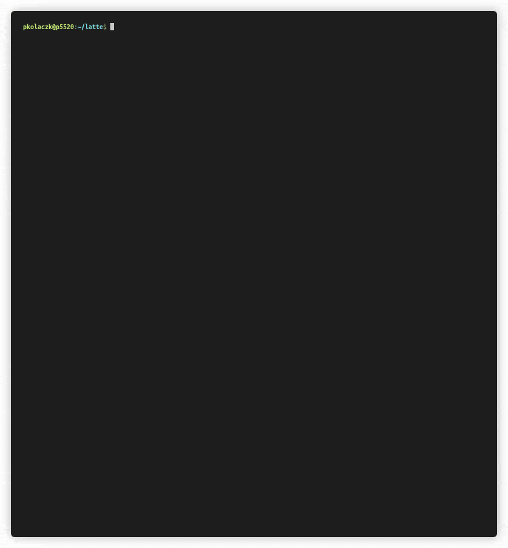

# Lightweight Benchmarking Tool for Apache Cassandra and ScyllaDB

**Runs custom CQL workloads against a Cassandra cluster and measures throughput and response times**



## Why Yet Another Benchmarking Program?

- Latte outperforms other benchmarking tools for Apache Cassandra by a wide margin. See [benchmarks](BENCHMARKS.md).
- Latte aims to offer the most flexible way of defining workloads.

### Performance

Contrary to
[NoSQLBench](https://github.com/nosqlbench/nosqlbench),
[Cassandra Stress](https://cassandra.apache.org/doc/4.0/cassandra/tools/cassandra_stress.html)
and [tlp-stress](https://thelastpickle.com/tlp-stress/),
Latte has been written in Rust and uses the native Cassandra driver from Scylla.
It features a fully asynchronous, thread-per-core execution engine,
capable of running thousands of requests per second from a single thread.

Latte has the following unique performance characteristics:

* Great scalability on multi-core machines.
* About 10x better CPU efficiency than NoSQLBench.
  This means you can test large clusters with a small number of clients.
* About 50x-100x lower memory footprint than Java-based tools.
* Very low impact on operating system resources – low number of syscalls, context switches and page faults.
* No client code warmup needed. The client code works with maximum performance from the first benchmark cycle.
  Even runs as short as 30 seconds give accurate results.
* No GC pauses nor HotSpot recompilation happening in the middle of the test. You want to measure hiccups of the server,
  not the benchmarking tool.

The excellent performance makes it a perfect tool for exploratory benchmarking, when you quickly want to experiment with
different workloads.

### Flexibility

Other benchmarking tools often use configuration files to specify workload recipes.
Although that makes it easy to define simple workloads, it quickly becomes cumbersome when you want
to script more realistic scenarios that issue multiple
queries or need to generate data in different ways than the ones directly built into the tool.

Instead of trying to bend a popular configuration file format into a turing-complete scripting language, Latte simply
embeds a real, fully-featured, turing-complete, modern scripting language. We chose [Rune](https://rune-rs.github.io/)
due to painless integration with Rust, first-class async support, satisfying performance and great support from its
maintainers.

Rune offers syntax and features similar to Rust, albeit with dynamic typing and easy automatic memory management. Hence,
you can not only just issue custom CQL queries, but you can program  
anything you wish. There are variables, conditional statements, loops, pattern matching, functions, lambdas,
user-defined data structures, objects, enums, constants, macros and many more.

## Features

* Compatible with Apache Cassandra 3.x, 4.x, DataStax Enterprise 6.x and ScyllaDB
* Custom workloads with a powerful scripting engine
* Asynchronous queries
* Prepared queries
* Programmable data generation
* Workload parameterization
* Data validation
* Retries
* Reading of data from files
* Accurate measurement of throughput and response times with error margins
* Can generate HDR histogram files on the fly for more precise perf measurement
* Configurable number of connections and threads
* Rate, sine-wave-alike rate and concurrency limiters
* Progress bars
* Beautiful text reports
* Can dump report in JSON
* Side-by-side comparison of two runs
* Statistical significance analysis of differences corrected for auto-correlation

## Installation

## From source

1. [Install Rust toolchain](https://rustup.rs/)
2. Run `RUSTFLAGS="--cfg fetch_extended_version_info" cargo install --path .`

## From release binaries

1. [Open Latte releases page on GitHub](https://github.com/scylladb/latte/releases)
2. Click drop-down for `Assets` of any of the releases
3. Download any available binary for a release

## From docker image

1. [Open list of docker images](https://hub.docker.com/r/scylladb/latte/tags)
2. Pull specific version like `docker pull scylladb/latte:0.42.1-scylladb`
3. Or pull latest (alias for the greatest specific release) version like `docker pull scylladb/latte:latest`

## Usage

Start a DB cluster somewhere (can be a local node). Then run:

```shell
latte schema <workload.rn> [<node address>] # create the database schema 
latte run -f write -d 1000 <workload.rn> [<node address>] # populate the DB with 1000 rows
latte run -f read -d 30s <workload.rn> [<node address>] # execute the read workload for 30 seconds
 ```

You can find a few example workload files in the `workloads` folder.
For convenience, you can place workload files under `/usr/share/latte/workloads` or `.local/share/latte/workloads`,
so latte can find them regardless of the current working directory. You can also set up custom workload locations
by setting `LATTE_WORKLOAD_PATH` environment variable.

Latte may produce text reports on stdout and also save all data to a json file in the working directory.
To enable it use `--generate-report` latte parameter.
The name of the file is created automatically from the parameters of the run and a timestamp.

You can display the results of a previous run with `latte show`:

```shell
latte show <report.json>
latte show <report.json> -b <previous report.json>  # to compare against baseline performance
```

Run `latte --help` to display help with the available options.

## Workloads

Workloads for Latte are fully customizable with embedded scripting language [Rune](https://rune-rs.github.io/).

A workload script defines a set of public functions that Latte calls automatically. A minimum viable workload script
must define at least a single public async function `run` with two arguments:

- `ctx` – session context that provides the access to Cassandra
- `i` – current unique cycle number of a 64-bit integer type, starting at 0

The following script would benchmark querying the `system.local` table:

```rust
pub async fn run(ctx, i) {
    ctx.execute("SELECT cluster_name FROM system.local LIMIT 1").await
}
```

Instance functions on `ctx` are asynchronous, so you should call `await` on them.

The workload script can provide more than one function for running the benchmark.
In this case you can name those functions whatever you like, and then select one of them
with `-f` / `--function` parameter.

### Schema creation

You can (re)create your own keyspaces and tables needed by the benchmark in the `schema` function.
The `schema` function is executed by running `latte schema` command.

```rust
const KEYSPACE = latte::param!("keyspace", "latte");
const TABLETS = latte::param!("tablets", true); // ScyllaDB-specific
const REPLICATION_FACTOR = latte::param!("replication_factor", 3);

pub async fn schema(ctx) {
    ctx.execute(`
        CREATE KEYSPACE IF NOT EXISTS ${KEYSPACE} WITH REPLICATION = {
            'class': 'NetworkTopologyStrategy',
            'replication_factor': ${REPLICATION_FACTOR}
        } 
        AND tablets = {'enabled': ${TABLETS}}
    `).await?;
    ctx.execute("CREATE TABLE IF NOT EXISTS test.test(id bigint, data varchar)").await?;
}
```

### Prepared statements

Calling `ctx.execute` is not optimal, because it doesn't use prepared statements.
You can prepare statements and register them on the context object in the `prepare`
function:

```rust
const INSERT = "my_insert";
const SELECT = "my_select";

pub async fn prepare(ctx) {
    ctx.prepare(INSERT, "INSERT INTO test.test(id, data) VALUES (?, ?)").await?;
    ctx.prepare(SELECT, "SELECT * FROM test.test WHERE id = ?").await?;
}

pub async fn run(ctx, i) {
    ctx.execute_prepared(SELECT, [i]).await
}
```

Query parameters can be bound and passed by names as well:

```rust
const INSERT = "my_insert";

pub async fn prepare(ctx) {
    ctx.prepare(INSERT, "INSERT INTO test.test(id, data) VALUES (:id, :data)").await?;
}

pub async fn run(ctx, i) {
    ctx.execute_prepared(INSERT, # { id: 5, data: "foo" }).await
}
```

To tweak prepared statements logic based on the rune functions we plan to use with workload
we can do following:

```rust
pub async fn prepare(ctx) {
    if !is_none(ctx.data.get("functions_to_invoke")) {
        for item in ctx.data.functions_to_invoke {
            // NOTE: 'item' is tuple like '(fn_name_as_str, fn_weight_as_f64)'
            let fn_name = item.0;
            if fn_name == "simple" {
                println!("rune-info: SKIP heavy operations preparing 'simple' function.");
                return
            }
        }
    }
    ...
    // Some heavy operations
}
```

### Data population

There are 2 possible ways to populate data.
First is for simple scenarios using `latte load` command
which utilizes `load`, `erase` and `prepare` rune functions.

Second is when we run complex test scenario with multiple latte commands.

## Simple way of populating the database for single-latte command testings

To be able to load data into tables with `latte load` command,
you need to set the number of load cycles on the context object and define the `load` function:

```rust
pub async fn prepare(ctx) {
    ctx.load_cycle_count = 1000000;
}

pub async fn load(ctx, i) {
    ctx.execute_prepared(INSERT, [i, "Lorem ipsum dolor sit amet"]).await
}
```

It is also recommended to define the `erase` function to erase the data before loading
so that you always get the same dataset regardless of the data that were present in the database before:

```rust
pub async fn erase(ctx) {
    ctx.execute("TRUNCATE TABLE test.test").await
}
```

## Enhanced way of populating your DB for complex test scenarios

Assume we have 2 latte executer machines/VMs and we need to populate 1 billion of rows.
We do:

- Define required `schema` function as shown above
- Define optional `prepare` function which runs once before the latte workload and useful
  for setting and pre-calculating things needed to be done once for whole workload.
- Define any public-facing rune function (name must not overlap with the reserved ones).
  - If we plan to have just 1 rune function, we can call it `run` and avoid specifying the `-f` parameter.
  - If we plan to have 2+ rune functions then we use the `-f / --function ` latte parameter.

So, assume we have following in our rune script:

```rust
const ROW_COUNT = latte::param!("row_count", 1000000); // use it to define the expected row count in cluster
const BLOB_SIZE = latte::param!("blob_size", 1000);
const P_STMT_INSERT = "p_stmt__insert";

pub async fn write(ctx, i) {
    let idx = i % ROW_COUNT;
    let pk = text(idx, 36);
    let ck = text(idx + hash(idx), 36);
    let data = blob(idx, BLOB_SIZE);
    ctx.execute_prepared(P_STMT_INSERT, [pk, ck, data]).await?
}
```

Then we populate a DB cluster using 2 latte commands as following:

```bash
$ latte run <rune-script> <addr> -q -f write -d 500000000 --start-cycle 0
$ latte run <rune-script> <addr> -q -f write -d 500000000 --start-cycle 500000000
```

Above 2 commands will write 2 halfs of our data set.

### Generating data

Latte comes with a library of data generating functions. They are accessible in the `latte` crate. Typically, those
functions accept an integer `i` cycle number, so you can generate consistent numbers. The data generating functions
are pure, i.e. invoking them multiple times with the same parameters yields always the same results.

- `latte::uuid(i)` – generates a random (type 4) UUID
- `latte::hash(i)` – generates a non-negative integer hash value
- `latte::hash2(a, b)` – generates a non-negative integer hash value of two integers
- `latte::hash_range(i, max)` – generates an integer value in range `0..max`
- `latte::hash_select(i, vector)` – selects an item from a vector based on a hash
- `latte::blob(i, len)` – generates a random binary blob of length `len`
- `latte::normal(i, mean, std_dev)` – generates a floating point number from a normal distribution
- `latte::normal_f32(i, mean, std_dev)` – generates a floating point 32bit number from a normal distribution
- `latte::uniform(i, min, max)` – generates a floating point number from a uniform distribution
- `latte::text(i, length)` – generates a random string
- `latte::vector(length, function)` – generates a vector of given length with a function
  that takes an integer element index and generates an element
- `latte::join(vector, separator)` – joins a collection of strings using a separator
- `x.clamp(min, max)` – restricts the range of an integer or a float value to given range

#### Type conversions

Rune uses 64-bit representation for integers and floats.
Since version 0.28 Rune numbers are automatically converted to proper target query parameter type,
therefore you don't need to do explicit conversions. E.g. you can pass an integer as a parameter
of Cassandra type `smallint`. If the number is too big to fit into the range allowed by the target
type, a runtime error will be signalled.

The following methods are available:

- `x as i64` – converts any number to an integer
- `x as f64` – converts any number to a float
- `x.parse::<i64>()` – parses a string as an integer
- `x.parse::<f64>()` – parses a string as a float
- `x.to_string()` – converts a float or integer to a string

#### Text resources

Text data can be loaded from files or resources with functions in the `fs` module:

- `fs::read_split_lines_iter(path, delimiter, do_trim, skip_empty)` – returns an iterator
  that reads a file line by line, splits each line using the given delimiter,
  trims each element (optional) and skips empty ones (optional).
- `fs::read_to_string(file_path)` – returns file contents as a string
- `fs::read_lines(file_path)` – reads file lines into a vector of strings
- `fs::read_words(file_path)` – reads file words (split by non-alphabetic characters) into a vector of strings
- `fs::read_resource_to_string(resource_name)` – returns builtin resource contents as a string
- `fs::read_resource_lines(resource_name)` – returns builtin resource lines as a vector of strings
- `fs::read_resource_words(resource_name)` – returns builtin resource words as a vector of strings

The resources are embedded in the program binary. You can find them under `resources` folder in the
source tree.

To reduce the cost of memory allocation, it is best to load resources in the `prepare` function only once
and store them in the `data` field of the context for future use in `load` and `run`:

```rust
pub async fn prepare(ctx) {
    ctx.data.last_names = fs::read_lines("lastnames.txt")?;
    // ... prepare queries
}

pub async fn run(ctx, i) {
    let random_last_name = latte::hash_select(i, ctx.data.last_names);
    // ... use random_last_name in queries
}
```

Or example using flexible file lines iterator:
```rust
const DATAFILE = latte::param!("datafile", "<path-to>/huge-file.txt");

pub async fn prepare(ctx) {
    let delimiter = " ";
    let do_trim = true;
    let skip_empty = true;
    let maxsplit = -1; // any negative means "no limit"
    // NOTE: second element for the 'fs::read_split_lines_iter' may also be empty or partial.
    let file_iterator = fs::read_split_lines_iter(DATAFILE, [delimiter, maxsplit, do_trim, skip_empty])?;
    ctx.data.huge_data_set = [];
    while let Some(words) = file_iterator.next() {
        let current_words = words?; // unwrap ok/err
        dbg!(current_words); // optional debug print out of the taken data
        if !current_words.is_empty() { // may be empty vector if all elements are filtered out
            ctx.data.huge_data_set.push(current_words)
        }
    }
    dbg!(ctx.data.huge_data_set); // optional debug print out of the processed data

    // ... prepare queries
}
...
```

### Parameterizing workloads

Workloads can be parameterized by parameters given from the command line invocation.
Use `latte::param!(param_name, default_value)` macro to initialize script constants from command line parameters:

```rust
const ROW_COUNT = latte::param!("row_count", 1000000);

pub async fn prepare(ctx) {
    ctx.load_cycle_count = ROW_COUNT;
} 
```

Then you can set the parameter by using `-P`:

```
latte run <workload> -P row_count=200
```

### Multi-row partitions with different row count

If there is a need to simulate real-life case where we have multi-row partitions
and their sizes differ we can easily cover it with latte.

First step is to define following function in the `prepare` section of a rune script:
```
  pub async fn prepare(db) {
    ...
    db.init_partition_row_distribution_preset(
      "foo", ROW_COUNT, ROWS_PER_PARTITION, "70:1,20:2.5,10:3.5").await?;
    ...
  }
```

With this function we pre-create a preset with the `foo` name
and instruct it to calculate number of partitions and their rows-sizes like following:
- `70%` of partitions will be of the `ROWS_PER_PARTITION` size
- `20%` of `2.5*ROWS_PER_PARTITION`
- `10%` of the `3.5*ROWS_PER_PARTITION`.

Then, in the target functions we can reuse it like following:
```
  pub async fn insert(db, i) {
    let idx = i % ROW_COUNT + OFFSET;
    let partition_idx = db.get_partition_idx("foo", idx).await + OFFSET;
    ...
  }
```

As a result we will be able to get multi-row partitions in a requested size proportions.

Number of presets is unlimited. Any rune script may use multiple different presets for different tables.

### Validating number of rows for SELECT queries

It is possible to validate number of rows.

It can be done using 2 methods.

First is `execute_with_validation` which is extended version of the common `execute` function.
Second is `execute_prepared_with_validation` which is extended version of the `execute_prepared` respectively.

Each of these methods expects, as a last parameter, a vector of `Rune Value`s.
Both support following combinations:
- [Integer] -> Exact number of expected rows
- [Integer, Integer] -> Range of expected rows, both values are inclusive.
- [Integer, String] -> Exact number of expected rows and custom error message.
- [Integer, Integer, String] -> Range of expected rows and custom error message.

Example using three validation elements:
```
  pub async fn some_select_rune_function(db, i) {
    ...
    let elapsed = db.elapsed_secs();
    let rows_min = if elapsed > 100.0 { 0 } else { 1 };
    let rows_max = if elapsed < 150.0 { 1 } else { 0 };
    let custom_err = "rows must have been deleted by TTL after 100s-200s";
    db.execute_prepared_with_validation(
        PREPARED_STATEMENT_NAME,
        [pk],
        [rows_min, rows_max, custom_err],
    ).await?
  }
```

Example using just one validation element (expected strict number of rows):
```
  pub async fn prepare(db) {
    db.init_partition_row_distribution_preset(
      "main", ROW_COUNT, ROWS_PER_PARTITION, PARTITION_SIZES).await?;
    ...
  }

  pub async fn some_select_rune_function(db, i) {
    let idx = i % ROW_COUNT + OFFSET;
    let partition = db.get_partition_info("main", idx).await;
    partition.idx += OFFSET;
    db.execute_prepared_with_validation(
      PREPARED_STATEMENT_NAME,
      [pk],
      [partition.rows_num], // precise matching to calculated partition rows number
    ).await?
  }
```

#### Row count validation error messages examples

Standard row count validation error message for strict row number:
```
2025-05-26 15:20:22.268: [ERROR][Attempt 0/0] Expected '0' rows in the response, but got '1'. \
  Query: "SELECT pk, ck FROM latte.validation WHERE pk = :pk LIMIT 1" with params [BigInt(4459089576838673207)]
```

Strict row number with custom error message:
```
2025-05-26 15:20:49.318: [ERROR][Attempt 0/0] Expected '0' rows in the response, but got '1'. \
  Query: "SELECT pk, ck FROM latte.validation WHERE pk = :pk LIMIT 1" with params [BigInt(4459089576838673207)] . \
  Custom error msg: expected to get only 1 row
```

Row number range without custom error message:
```
2025-05-26 15:21:35.281: [ERROR][Attempt 0/0] Expected '3<=N<=4' rows in the response, but got '6'. \
  Query: "SELECT pk, ck FROM latte.validation WHERE pk = :pk LIMIT :max_limit" with params [BigInt(4459089576838673207), Int(16)]
```

### Validating data taken from SELECT queries

Complex example of the data validation is available
at the [workloads/data_validation.rn](https://github.com/scylladb/latte/blob/update-readme/workloads/data_validation.rn)
rune script.
Simpler example of data validation is following:

```rust
async fn generate_row_data(db, i) { // may be equally used for 'write' and 'read' operations
    let idx = i % ROW_COUNT;
    let pk = hash(idx);
    let div3 = idx % 3;
    let col_bool = if div3 == 0 { None } else { div3 == 1 };
    let col_blob = if idx % 16 == 0 { None } else { blob(idx + 400, hash_range(idx, 64)) };

    let ret = #{ // Object with attrs as a return value
        "pk": pk,
        "col_bool": col_bool,
        "col_blob": col_blob,
    };
    ret
}

pub async fn read(db, i) {
    let d = generate_row_data(db, i).await;
    let rows = db.execute_prepared_with_result(P_STMT.GET.NAME, [d.pk]).await?;
    for col_name in d.col_names {
        let actual = rows.0.get(col_name)?;
        let expected = d.get(col_name)?;
        if !is_none(expected) {
            if actual != expected {
                db.signal_failure(
                    `Column '${col_name}'. Actual value is '${actual}', but expected is '${expected}'`
                ).await?;
            }
        } else {
            assert!(is_none(actual));
        }
    }
}
```

The `assert` macros stops stress execution right away if condition result is `false`.

The `ctx.signal_failure(...)` context function allows to handle data validation errors gracefully.

For example, if we assume that data update is racy,
we may configure retries to mitigate possible temporary data validation failures:

```bash
$ latte run ... --validation-strategy=retry ...
```

Supported values for the `--validation-strategy` parameters are `fail-fast` (default), `retry` and `ignore`.

### Mixing workloads

It is possible to run more than one workload function at the same time.
You can specify multiple functions with `-f` / `--function` and optionally give
each function the weight which will determine how frequently the function should be called.
If unspecified, the default weight is 1. Weights don't have to sum to 1.

Assuming the workload definition file contains functions `read` and `write`, the following
invocation of latte will run a mix of 20% writes and 80% reads:

```
latte run <workload> -f read:0.2 -f write:0.8
```

### Error handling

Errors during execution of a workload script are divided into three classes:

- compile errors – the errors detected at the load time of the script; e.g. syntax errors or referencing an undefined
  variable. These are signalled immediately and terminate the benchmark even before connecting to the database.
- runtime errors / panics – e.g. division by zero or array out of bounds access. They terminate the benchmark
  immediately.
- error return values – e.g. when the query execution returns an error result. Those take effect only when actually
  returned from the function (use `?` for propagating them up the call chain). All errors except Cassandra overload
  errors terminate  
  the benchmark immediately. Overload errors (e.g. timeouts) that happen during the main run phase are counted and
  reported in the benchmark report.

### Other functions

- `ctx.elapsed_secs()` – returns the number of seconds elapsed since starting the workload, as float
- `ctx.now_timestamp()` – generates a timestamp with `now` value
- `ctx.get_datacenters()` – returns list of discovered datacenters for a DB cluster
- `ctx.is_none(v)` – checks the provided rune object for having a value and returns boolean result
